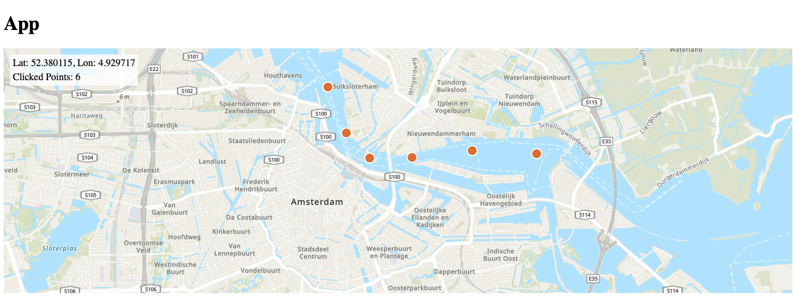

# MapViewer

MapViewer is a React application that displays an interactive map using ArcGIS.

## Features

- Interactive map display using ArcGIS
- React-based user interface
- Docker containerization for easy deployment

## Screenshot



## Technologies Used

- React
- ArcGIS API for JavaScript
- Docker

## Getting Started

### Prerequisites

- Docker and Docker Compose installed on your system

### Running the Application

1. Clone this repository
2. Navigate to the project directory
3. Build the Docker image:
   ```
   docker-compose build
   ```
4. Start the application:
   ```
   docker-compose up
   ```
5. Open your browser and visit `http://localhost:3000` (or the port you've configured)

